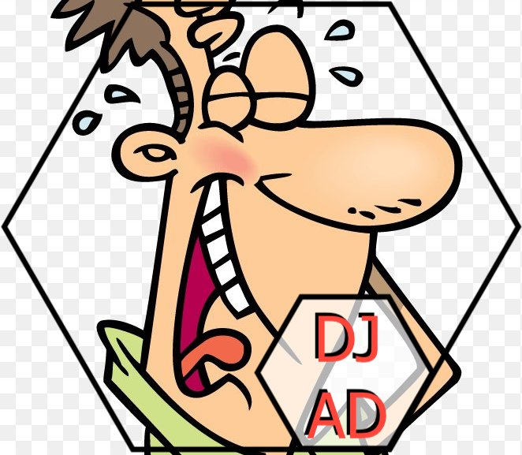
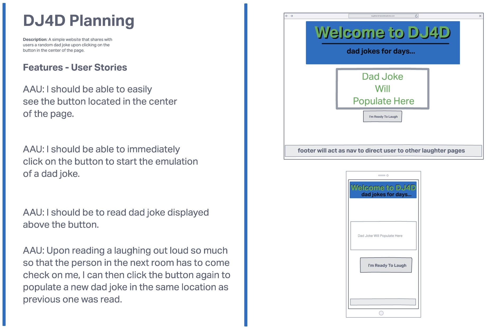
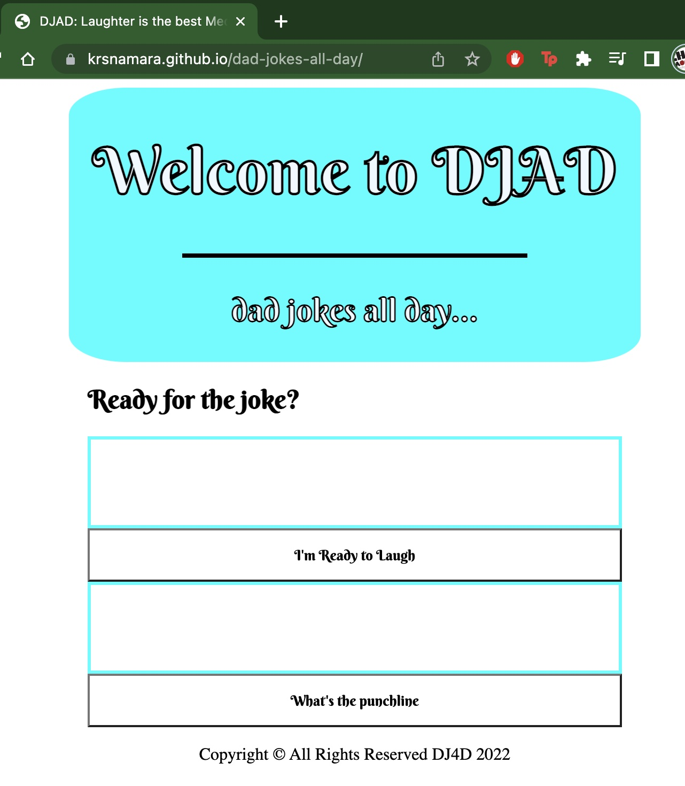

[^1] 
# Laughter is the Best Medicine 
***
## Description
A simple web page that generates dad jokes to a user so that they can laugh a lot.
***
## Technologies Used
- HTML5
- CSS3
- JavaScript/jQuery
- Rapid API Dad Jokes API
- Git/Github - Github Pages for Hosting
***
## Screenshots

 
***
### Production version

***
## Deployed Website
[get ready to laugh...](https://krsnamara.github.io/dad-jokes-all-day/) to visit deployed app! 
***
## Future Enhancements
- Adding a feature that allows users to create accounts to save data
- Adding a feature that allows a user to rate jokes
- Adding a feature that allows a user to save favorite jokes
- Adding a feature for users to vote on jokes and compare to other users votes
- Adding a feature to have users write their own jokes to add

[^1]: Laughing Dad image came from [FAVEPNG Website](https://favpng.com/png_view/laughing-clipart-cartoon-royalty-free-laughter-clip-art-png/jeH9qJp5)
